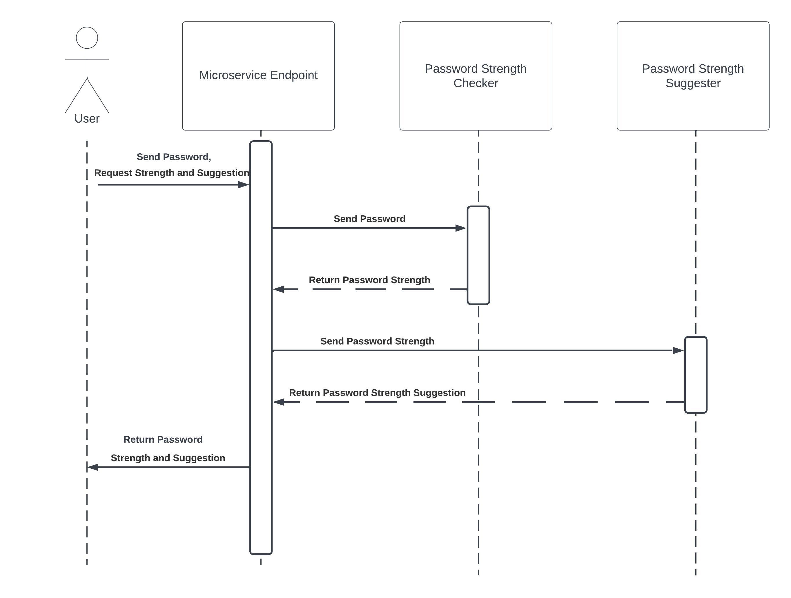

# Password Strength Checker Microservice
This microservice takes in a password and returns it's strength and (optional) suggestions on improving password strength.

# Installation
- Git clone repository 
- run `npm install` to install packages

# Operation
- run `node .` to start server on http://localhost:8080

# Communcation Contract

## Requesting Data

Send a `POST` request to `http://localhost:8080/pswd/strength` containing the following JSON body

```
{
    "password": "123",
    "returnSuggestion": true
}
```
*If don't need the return suggestion omit it from the JSON body or change the value to `false`.

## Receiving Data
The `res` object returned from the `POST` request (if using JS and express) will return a JSON object in the following format:

```
{
    "strength": "weak",
    "suggestion": "This password is weak, try adding at least one lowercase letter, one uppercase letter, one digit, and have a minimum of 8 characters."
}
```
*If `returnSuggestion` is omitted or set to `false` in the `POST` request, the `suggestion` field will not be returned in `res`.

# UML Sequence Diagram


